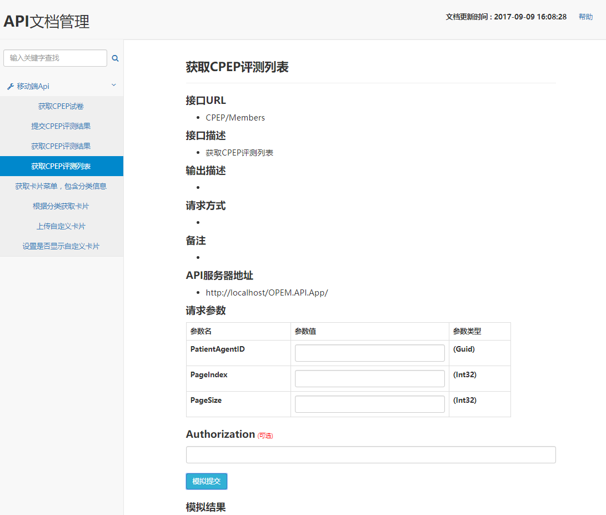
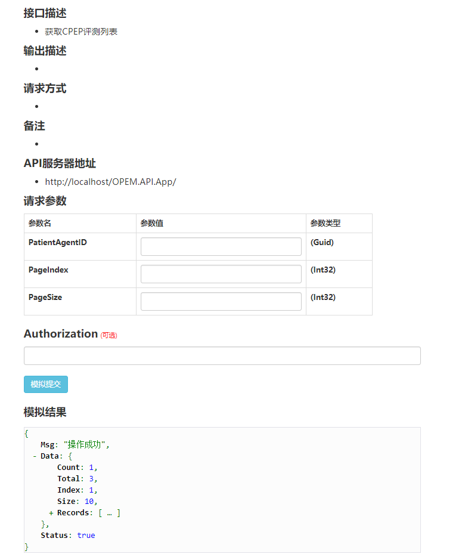

# ApiView

## 介绍:     

主要是利用attribute标注要产生API文档的Action，通过动态加载程序集反射获取公开的函数，并获取attribute 中的文档注释。 本API文档工具可实现简单的在线模拟请求，美化返回的json数据对象。支持通用的GET以及POST请求， 支持简单对象的POST请求，同样也支持简单文件上传，可根据自己实际需要改造此API文档工具。

## Authorization:   

关于接口调用参数Authorization使用方法，该参数是可选参数，可根据项目实际情况使用。 模拟请求时，会将值添加到Header中发送。 可根据实际项目需求使用此参数实现HTTP协议基本认证。
  
## 更新API文档:    

将发布后的dll文件重新复制到设置的dll目录下（需要暂停当前IIS站点目录才能复制，因为是通过 启动站点后通过 Assembly.LoadFrom("dll路径") 动态加载的程序集至应用程序域中，会一直占用当前目录下的dll文件。所以需要关闭当前 IIS站点才能复制，对于此种情况暂未想出什么好的解决办法）。
   
## 关于嵌套复杂类型: 

由于作者能力有限，本API文档工具暂时不支持多重嵌套的复杂引用类型参数,只能暂时通过手动拼写json数据测试模拟请求。

## Screenshots

### 1.主页

### 2.返回结果json格式化

### 3.使用attribute标注需要公开的接口

